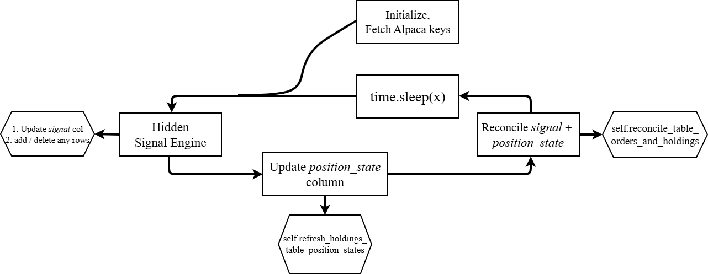
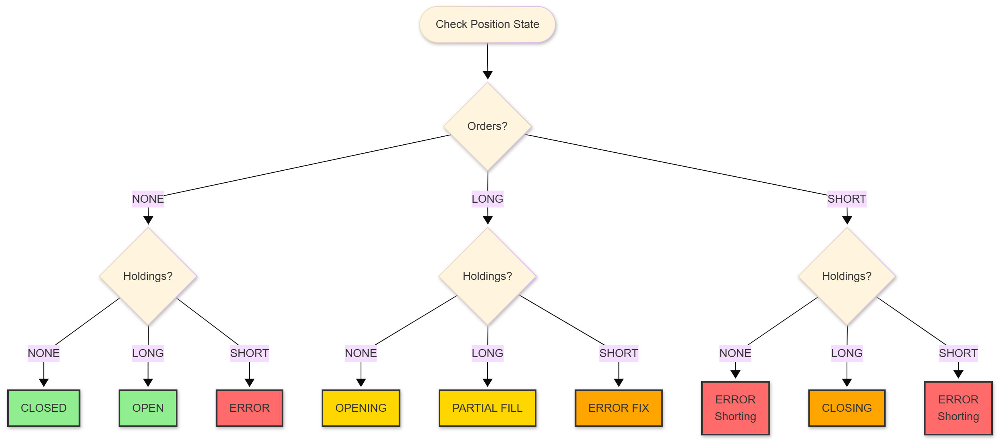
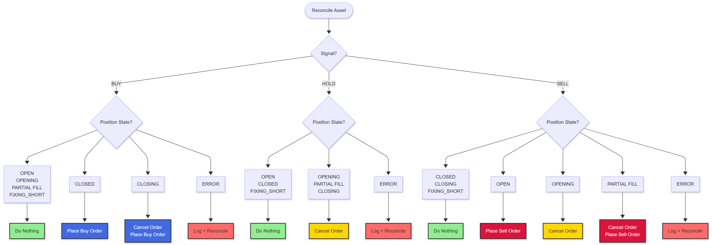

# Architecture

## trading_bot.py

Below is the principle design of the bot. For a simple strategy, we can condense the data and decision on an asset to a simple *signal* ∈ {'BUY' , 'HOLD' , 'SELL'}. Paired with a *position_state* for each asset we want to trade, we can base all of our decisions on these two columns. 

The bot therefore centres around:
1. Keeping *signal* and *position_state* updated and reflective of current conditions.
2. Reconciling *position_state* to reflect *signal*.

The flowchart shows how this happens:

### Position State

As mentioned, *position_state* condenses combinations of orders and holdings into a single TEXT value. And based on *position_state* + *signal* we may make a decision such as:
- *position_state* == 'CLOSED', *signal* == 'BUY', action -> send buy order.

### Actions

After refreshing *position_state* and *signal*, for each row in *holdings* table, we can reconcile these two columns and act on any changes between them.

This is done with the *reconcile_table_orders_and_holdings* method, as shown in the first flowchart in this document (the final step before we sleep).

